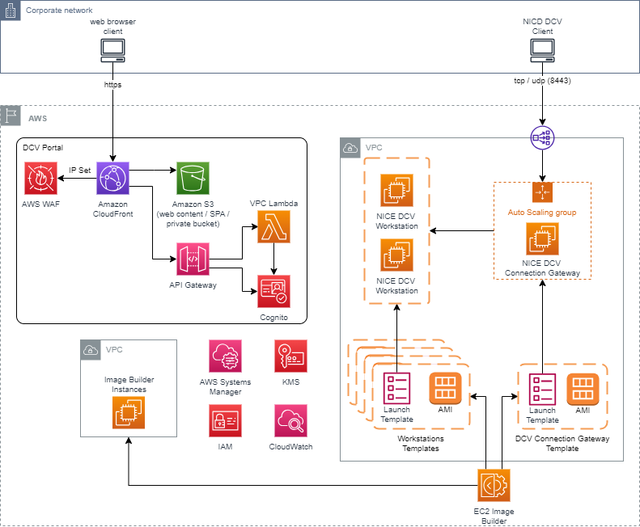

# NICE DCV-based VDI Solution

> :warning: This is an unoffical extension of the previously published [Customisable DCV-based VDI Solution](https://github.com/aws-samples/dcv-web-portal) which includes a set of additional features currently not available in the previous version nor in the _[Research and Engineering Studio on AWS](https://aws.amazon.com/hpc/res/)_ product like:
> 
> * support OS images like Micorsoft Windows, Ubuntu etc...
> * implement a "template" factory
> * reuse or create a VPC
> * use a NGinx proxy instead of CloudFront when using private network
> 
> I strongly recommend to investigate the _[Research and Engineering Studio on AWS](https://aws.amazon.com/hpc/res/)_, which is a solution officially maintained and supported by AWS, and providing many features that are not covered by this sample (SAML, persistence of the workstations, file sharing, ...). 

Current version: **1.0.3**

## Main Features

The solution provides access to a web portal where users can access a customizable Virtual Desktop Infrastructure (VDI) leveraging the NICE DCV protocol with:

 - Virtual Desktop Infrastructure (VDI) / Remote Desktop solution based on [NICE DCV](https://docs.aws.amazon.com/dcv/latest/adminguide/what-is-dcv.html) server and [NICE DCV Connection Gateway](https://docs.aws.amazon.com/dcv/latest/gw-admin/what-is-gw.html).
 - Workstation images customization and automation.
 - Web portal for users to easily start and access their workstations.
 - Deployable in an existing VPC or creating a new one
 - Define new "templates" to be deployed using configuration files (not code or clicks)
 - Work in a "private" networking mode (limited to no internet access needed)

Compared to other alternatives, this solution provides:

- Improved streaming performance (using NICE DCV instead of PCoIP), to support very demanding 3D graphical applications.
- More flexibility, with the ability to quickly spin up and shut down projects (new workstation images).
- Automated processes for deployments (with Terraform) and workstation images build and deployment.
- Web access (no AWS console need) for users and admins.
- Possibility to define and customize your level of security at different levels: data encryption at rest (with KMS customer managed keys) and in transit, private subnets, traceability and auditability, image updates...).

## Architecture <a name="architecture"></a>

Below is the high level architecture diagram describing the solution infrastructure when deployed in a "public" mode:



For more details please check the [detailed architecture page](./docs/architecture.md).

## Requirements <a name="requirements"></a>

The deployment will leverage *[Terraform](https://www.terraform.io/)* and will need to be executed from a **"machine"** with certain software installed and confugured. The instructions listed below assumes the use of a Linux based environment (including Microsoft Windows Sybsystem for Linux).

Before getting started with the deployment, you will to comply with the following requirements:

- An AWS Account (Please refer to [How to create an AWS account](https://aws.amazon.com/premiumsupport/knowledge-center/create-and-activate-aws-account) if you need to create one)

- To deploy the solution you will need an AWS IAM user or have the ability to assume an AWS IAM role with the following policies:
   - `PowerUserAccess`
   - `IAMFullAccess`

  > :warning: If you are planning to use an AWS Cloud9 instance, you will need to turn off the *AWS Managed Temporary credentials* as certain opertion will not be possible ([Actions supported by AWS managed temporary credentials](https://docs.aws.amazon.com/cloud9/latest/user-guide/security-iam.html#auth-and-access-control-temporary-managed-credentials-supported))
  >
  > Therefore, you will need to configure a local profile with access key and secret from an IAM user.
  >

Then you will need the following tools to be installed:

- [AWS CLI v2+](https://docs.aws.amazon.com/cli/latest/userguide/getting-started-install.html)

- [Terraform CLI v.1.7.0](https://developer.hashicorp.com/terraform/tutorials/aws-get-started/install-cli) 

- [Node.js v20+](https://docs.npmjs.com/downloading-and-installing-node-js-and-npm)

- [Python 3.10+](https://www.python.org/downloads/) and [pip 22+](https://pypi.org/project/pip/) 

- [Vite 5.2+](https://www.npmjs.com/package/vite)

- [Typescript 5.3+](https://www.npmjs.com/package/typescript)

- System packages:
  - unzip
  - curl
  - jq

An example script is provided for [Amazon Linux 2](./scripts/install-deps-azl2.sh) and [Ubuntu 20](./scripts/install-deps-ubuntu.sh) in the [scripts](./scripts/) directory.

## Deployment <a name="deployment"></a>

| Metric              | Value         |
|---------------------|---------------|
| **Deployment Time** | 20-30 minutes |

This solution support different deployment options:
- use an existing VPC or create a new one (that you can customize if needed)
- *internet facing* or *private* mode (and support IP allow list for *internet facing* approach)

The solution comes with two parts:

- **[dcv-portal](#dcv-portal)**

  This will deploy the portal for the end users to get access to in order to start their instances and connect to it using NICE DCV.

  For more details about the **`dcv-portal`** design and configuration, you can check the **[detailed documentation](./docs/dcv-portal/)**.

- **[dcv-templates](#dcv-templates)**

  This will deploy your template to be accessed by the end users.

  For more details about the **`dcv-templates`**, you can check the **[detailed documentation](./docs/dcv-templates/)**.

You first need to deploy **`dcv-portal`** and then deploy **`dcv-templates`**. 

**`dcv-templates`** will utilize generated outputs from the **`dcv-portal`** execution (subnet ids, lambda names etc...).

---

### Deploying `dcv-portal` <a name="dcv-portal"></a>

Switch to the `dcv-portal` directory under `./code/terraform/apps`:

```bash
cd ./code/terraform/apps/dcv-portal
```

Then you will need to initialize the Terraform project:

```bash
terraform init
```

> :warning: If the above command fails, make sure that the [Requirements](#requirements) section was completed.

Then you can proceed with the Terraform `apply` command to deploy the Terraform project.

You will be required to provide an email address. This email address will be used to tag resources but also used to create the administrator user in Cognito for which you will receive an email with your temporary password. 

If you don't provide any additional configuration parameters, the solution will be deployed with the following default values:

```
- deployment_mode       = "public"
- ip_allow_list_enabled = true
- ip_allow_list         = ["<the deployment host IP address retrieved from https://ipv4.icanhazip.com>/32"]

- use_existing_vpcs     = false  

- vpc_dcv_cidr_block        = "192.168.0.0/16"
- vpc_dcv_subnets_az_count  = 2 
- vpc_dcv_subnets_cidr_bits = 4

- vpc_image_builder_cidr_block        = "192.168.1.0/24"
- vpc_image_builder_subnets_cidr_bits = 2  
```

For more details about the **`dcv-portal`** configurable parameters, you can click **[here](./docs/dcv-portal/)**.

Then, you can execute the following Terraform command to deploy/apply the project:

```bash
terraform apply
```

You will be required to ***approve*** the deployment. Alternatively, you can use the following command to ***auto-approve*** the deployment.

```bash
terraform apply -auto-approve
```

At the end of the apply process, you should logs that should look like the following:

```
Apply complete! Resources: xxx added, 0 changed, 0 destroyed.

Outputs:

config_deploymentMode = "public"
config_ip_allow_list = tolist([
  xxx.xxx.xxx.xxx
])
config_ip_allow_list_enabled = true
config_use_existing_vpcs = false
env_account_id = "xxxxxxxxxxxxx"
env_application = "portal"
env_environment = "dev"
env_prefix = "dcv"
env_project = "dcv"
env_region = "eu-west-1"
frontend_admin_email = "xxxxxxxxxxx@xxxxxxxxx.xxx"
frontend_admin_login = "admin"
frontend_url = "dxxxxxxxxxxxxxx.cloudfront.net"
portal_apiEndpoint = "https://xxxxxxxxxxx.execute-api.eu-west-1.amazonaws.com/api"
portal_connectionGatewayLoadBalancerEndpoint = "dcv-xxxxxxxxxxxxxxxx.elb.eu-west-1.amazonaws.com"
portal_connectionGatewayLoadBalancerPort = 8443
portal_identityPoolId = "eu-west-1:xxxxxxxx-xxxx-xxxx-xxxx-xxxxxxxxxxxx"
portal_userPoolId = "eu-west-1_xxxxxxxxxxx"
portal_userPoolWebClientId = "xxxxxxxxxxxxxxxxxxxxxxxxxxx"
```

You can now open the portal using the **`frontend_url`** displayed. You will receive a temporary password at the provided **`frontend_admin_email`** that you will be able to use with the **`frontend_admin_login`** as your administrator user name.

<a name="frontend_url"></a>
If you need to retireve the **`frontend_url`** and **`frontend_admin_login`**, you can execute the following command under the `./code/terraform/apps/dec-portal` folder:

```bash
terraform output -json | jq -r ".frontend_url.value"
terraform output -json | jq -r ".frontend_admin_login.value"
```

> :warning: Please refer to the [Troubleshooting](#troubleshooting) section if you encouter any errors accessing the NICE DCV Portal.

You can also click **[here](./docs/dcv-portal/)** for more details about the **`dcv-portal`** design and configuration topics like:

- networking configuration options:
  - use private / public subnets
  - create or reuse a VPC
  - IP Allow list
- NICE DCV deployment configuration
- users management
  - updating the administrator email address
  - adding users and groups

---

### Deploying `dcv-templates`

Switch to the `dcv-templates` directory under `./code/terraform/apps`:

```bash
cd ./code/terraform/apps/dcv-templates
```

Then you will need to initialize the Terraform project:

```bash
terraform init
```
> :warning: If the above command fails, make sure that the [Requirements](#requirements) section was completed.

Then you can proceed with the Terraform `apply` command to deploy the Terraform project.

If you don't provide any additional configuration parameters, the solution will be deployed using exported variables from the `dcv-templates` deployment which will be located in `./code/terraform/apps/dcv-templates/terraform.tfvars`.

It will include the follwoing details:

```
- project
- application
- environment
- prefix
- region
- account_id
- kms_key_id
- vpc_subnet_id_image_builder
- vpc_subnet_ids_workstation
- vpc_security_group_ids_image_builder 
- vpc_security_group_ids_workstation
- dcv_lambda_update_tags_function_name 
- dcv_lambda_run_pipeline_function_name
```

For more details about the **`dcv-portal`** configurable parameters, you can click **[here](./docs/dcv-portal/)**.

This project will deploy a set of EC2 Launch Templates and the appropriate AMI (built via EC2 Image Builder) that the end-users can access via the portal.

These templates are accessible in the following folder : `[./code/terraform/dcv-templates/config/templates](./code/terraform/dcv-templates/config/templates)`. 

To create your own new templates, please refer to the relevant section in the **[dcv-templates](./docs/dcv-templates)** guides. 

Then you can execute the following Terraform command to deploy/apply the project:

```bash
terraform apply
```

You will be required to ***approve*** the deployment. Alternatively, you can use the following command to ***auto-approve*** the deployment.

```bash
terraform apply -auto-approve
```

Once the deployement is completed, the templates will start to be build in the EC2 Image Builder servce and will appear after **10 to 15 minutes**.

You can click **[here](./docs/dcv-templates/)** for more details about the **`dcv-templates`** design and configuration topics like:

- adding new componnents
- adding new templates

---

## Usage <a name="usage"></a>

### Accessing the portal <a name="usage_portal"></a>

As mentioned earlier, once you have deployed **`dcv-protal`**, a series of output will be displayed including the **`frontend_url`**.

If you diddn't took note of the value, you can retieve it using the fowllowing commands:

```bash
cd ./code/terraform/apps/dcv-portal

terraform output -json | jq -r ".frontend_url.value"
```

For next steps using the portal, accessing the template, stating a workstation or accessing it, you can check the following [documentation](./docs/dcv-portal).

---

### User management

This sample comes with Cognito to authenticate users on the web portal with an ***adminisitrator*** Cognito user and an ***adminisitrator*** Cognito group. 

You must create users in Cognito, so they can connect to the frontend and associte them to proper group so they can get access to workstations templates. 

Once a user login to the portal, a password will be created one their first login in AWS Secrets Manager (`dcv-<username>-credentials`). This password will be needed by the user to connect to the workstation. 

> **Note: that this password is different from the Cognito one**.

When creating DCV sessions, a user is automatically created on the instance with the password found in AWS Secrets Manager. This user will be setup on the instance with administrator / sudo / wheel role.

> :warning: In a production environment, we recommend to integrate both the portal and instances with an Active Directory (eg. AD or equivalent).

---

### Creating / Managing Workstations Templates & Components

When deployin gthis solution, 4 sample templates are provided in [./code/terraform/apps/dcv-templates/config/templates/](./code/terraform/apps/dcv-templates/config/templates/):
- [Amazon Linux 2](./code/terraform/apps/dcv-templates/config/templates/custom-amazon-linux-2.json)
- [Ubuntu 20.04](./code/terraform/apps/dcv-templates/config/templates/custom-ubuntu-20-04.json)
- [Ubuntu 22.04](./code/terraform/apps/dcv-templates/config/templates/custom-ubuntu-22-04.json)
- [Microsoft Windows Server 2019](./code/terraform/apps/dcv-templates/config/templates/custom-windows-server-2019.json)

These templates are provided as JSON files where a set of configuration will define the worksations templates including:
- list of EC2 ImangeBuilder componnents to be installed
- base AMI image id to be used (with regexp pattern)
- AWS IAM policies to be assigned to the instances (managed and inline)
- list of possible instance famillies and sizes
- EBS volume type, size and parameters
- Cognito user group to be assicated with 

Each template JSON file will trigger the creation of an AWS EC2 Image Builder [pipeline](https://docs.aws.amazon.com/imagebuilder/latest/userguide/what-is-image-builder.html).

You can also find a series of samples components in [./code/terraform/apps/dcv-templates/config/components/](./code/terraform/apps/dcv-templates/config/components/).

After updating ay of the Workstations Templates & Components, use `terraform apply` to deploy the changes on the AWS Account. 
You will need to wait for 10-15 minutes to have the Image / Launch Template ready.

For more details about the creating & managing workstations templates & components, you can check the **[detailed documentation](./docs/dcv-templates/)**.

---

## Cleanup

Whenever you need to remove the solution and all the associated resources it has deployed on the account, apply the following instructions:

- First terminate all workstation instances either from the portal or the AWS EC2 console
- Destroy **`dcv-templates`**:

  ```bash
  cd ./code/terraform/apps/dcv-templates
  terraform destroy
  ```

- Destroy **`dcv-portal`**:

  ```bash
  cd ./code/terraform/apps/dcv-portal
  terraform destroy
  ```

---

## Troubleshooting

You can access the troubleshooting guide [here](./docs/troubleshooting.md).

---

## See Also

- The [License](LICENSE) of the project.
- If you want to contribute, please read [CONTRIBUTING.md](CONTRIBUTING.md).
