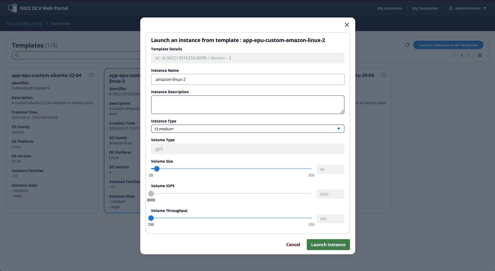

# NICE DCV-based VDI Solution - Portal


https://aws.amazon.com/blogs/architecture/enriching-amazon-cognito-features-with-an-amazon-api-gateway-proxy/

--- 

## Accessing the portal <a name="portal_access"></a>

Once you have open the portal using the **`frontend_url`** in your browser, you will be able to login: 


> :warning: If a blank page is displayed, it is most likely that the IP Allow list is not configured with you current IP address. 
>
> Please refer to the [Troubleshooting](#troubleshooting) section if you encouter any errors accessing the NICE DCV Portal.

Enter **`admin`** as username and the temporary password received by email then click on **Sign in**.


You will be prompted to change your password on the first sign in.

Then you should land on the **Instances** page:


--- 

## Starting a new workstation <a name="portal_workstation_start"></a>

On the top right corner of the page, click on **My Templates**. This should direct you to the list of available templates:


> :warning: If the list is empty, it is most likely because the EC2 ImageBuilder Pipelines didn't complete yet.
> 
> You can check the progress of the pipelines :
> - in the AWS Console (make sure to select the correct region): https://eu-west-1.console.aws.amazon.com/imagebuilder/home?region=eu-west-1#/viewPipelines
> - using the following command:
> ```bash
> region=eu-west-1
> account=xxxxxxxxxxxxxx
> template=dcv-custom-ubuntu-20-04
> aws imagebuilder list-image-pipeline-images --image-pipeline-arn arn:aws:imagebuilder:$region:$account:image-pipeline/$template --query '[imageSummaryList[*].[name, version, state.status] ]'
>```
>
> Please refer to the [Troubleshooting](#troubleshooting) section if you encouter any errors.

Select a template, the click on **Launch instance from template**.


Enter a **Instance Name**, and set any additional parameters as arequired then click on **Launch Instance**:



You can now click on **View Instance**:


The instance will launch in the background. Until the differnt status are all *green* you won't be able to access your work station:


---

## Accessing a workstation <a name="portal_workstation_access"></a>

Once the instance is all *green*, then you can select the instance. This will enable the **Connect with NICE DCV** action button:


You will need to download and install the [NICE DCV Client](https://download.nice-dcv.com/) on the first time.

Make you are using the **NICE DCV 2023.1 Client**.

Then you can **Download the connectin file**. The file download you begin in your browser.


Open the downloaded NICE DCV Client connection file. You will be requred to accept to trust the current connection on the first connection in order to access your workstation.


On the previous screen, hit enter to open the login screen:


> :warning: for Microsoft Windows instance, you need to use the drop down button on the top right to send a 'Ctrl + Alt + Del' command to open the login screen:
> 
> 

Then you will need to retireive you password to access the workstation. The password is generated on your first portal login and is stored in AWS Secrets Manager.

You can retrieve the password in the portal using the **<Profile> > Security** menu in the top right corner:


From there, you can toggle the **Show password**, and copy it from there:


Et Voila!


---

## User management

This sample comes with Cognito to authenticate users on the web portal with an ***adminisitrator*** Cognito user and an ***adminisitrator*** Cognito group. 

You must create users in Cognito, so they can connect to the frontend and associte them to proper group so they can get access to workstations templates. 

Once a user login to the portal, a password will be created one their first login in AWS Secrets Manager (`dcv-<username>-credentials`). This password will be needed by the user to connect to the workstation. 

> **Note: that this password is different from the Cognito one**.

When creating DCV sessions, a user is automatically created on the instance with the password found in AWS Secrets Manager. This user will be setup on the instance with administrator / sudo / wheel role.

> :warning: In a production environment, we recommend to integrate both the portal and instances with an Active Directory (eg. AD or equivalent).
